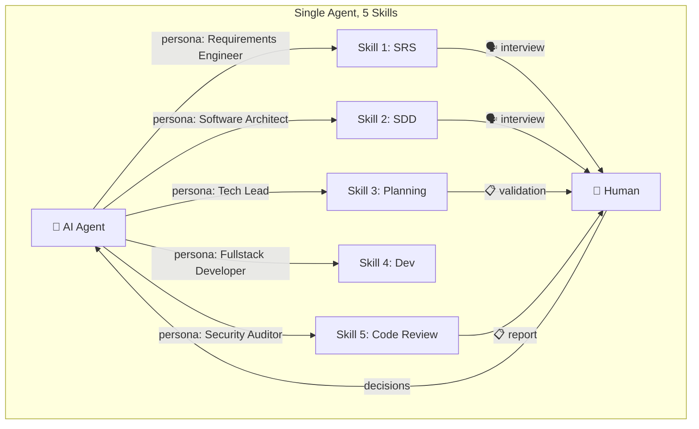
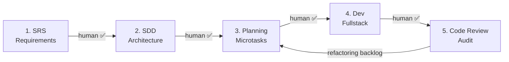
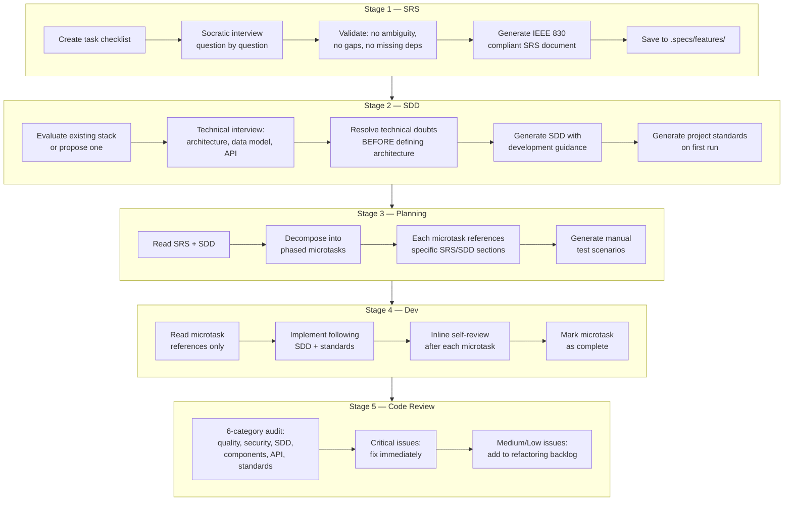
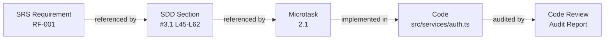
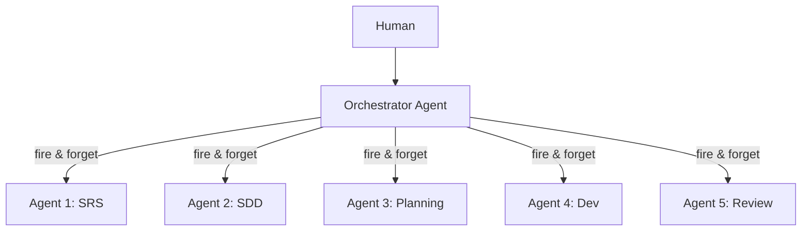
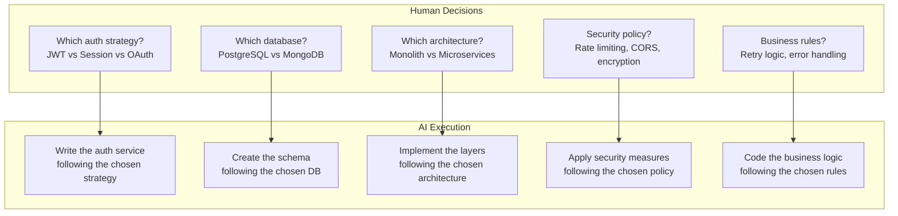
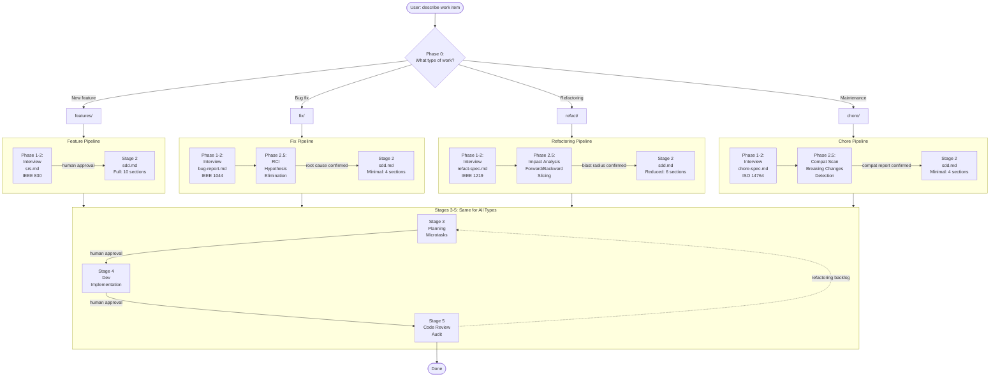
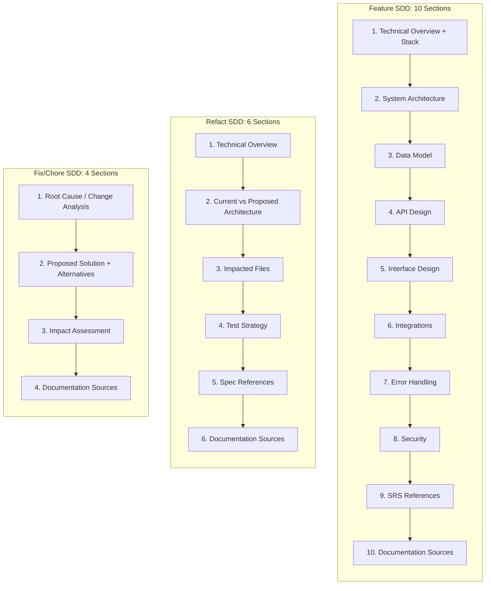

# SDDK Architecture

## Why a Single Agent with Multiple Skills?

SDDK deliberately uses a **single AI agent** that sequentially activates **5 specialized skills** — rather than multiple independent agents. This is not a technical limitation; it is an **architectural decision** grounded in the core principle that **critical technical decisions must never be fully delegated to AI**.



The human is **in the loop** at every decision point. The agent interviews, proposes, and executes — but the human **approves** before each stage advances.

---

## The Pipeline



Each stage produces an artifact that feeds the next. The human must explicitly approve each transition. The Code Review stage may generate a refactoring backlog that cycles back to Planning.

### Stage Breakdown



---

## Design Principles

### 1. Specifications Before Code

The AI agent **must never write a single line of code** before producing formal specifications. This eliminates the most common failure mode of AI-assisted development: "tutorial-quality" code that is functional but poorly structured, undocumented, and difficult to maintain.

```
❌ User says "build me auth" → AI immediately writes code → spaghetti

✅ User says "build me auth" → SRS interview → SDD design → Planning → Dev → Review
```

### 2. Human Authority Over Technical Decisions

Every architectural choice — stack selection, design patterns, data model, API design, security policies — goes through a **human decision gate**. The agent proposes options with trade-offs; the human chooses.

This is critical because:

- **Security decisions** (auth strategy, data encryption, CORS policy) have legal and compliance implications that AI cannot fully evaluate
- **Architecture decisions** (monolith vs microservices, SQL vs NoSQL) depend on team skills, infrastructure constraints, and business context that AI lacks
- **Business rules** (what happens on 3 failed login attempts?) require domain knowledge that only the human stakeholder possesses
- **AI hallucination risk** is highest for nuanced technical decisions — a human checkpoint catches errors before they propagate downstream

### 3. Traceability

Every line of code traces back to a requirement:



If a bug is found in production, you can trace it back through: Code → Microtask → SDD Section → SRS Requirement → Original interview answer.

### 4. Optimized Context Usage

The Dev stage (Stage 4) uses a **pointer-based memory strategy** to avoid context bloat:

```
❌ Load entire SRS + SDD + Plan into context (50K+ tokens)

✅ Each microtask has pointers to specific lines:
   📎 Ref SDD: sdd.md#L45-L62 (18 lines)
   📎 Ref SRS: srs.md#L80-L95 (16 lines)
   → Only ~34 lines loaded per microtask
```

This means the agent reads **only** the relevant sections for each task, keeping the context window clean and focused.

---

## Single Agent vs Multi-Agent: Comparison

### Multi-Agent Approach (Evaluated and Rejected)



In a multi-agent architecture, each stage runs in its own isolated agent. This was **evaluated and rejected** for the following reasons:

| Criterion | Single Agent + Skills ✅ | Multi-Agent ❌ |
|:---|:---:|:---:|
| **Human interactivity** | Continuous dialogue | Fire-and-forget |
| **Socratic interview** | Question by question | Impractical |
| **Technical decisions** | Human decides in real-time | Delegated to AI |
| **Context continuity** | Shared session memory | Each agent starts from zero |
| **Security decisions** | Human-gated | AI-autonomous |
| **Compatibility** | Works in any IDE agent | Platform-specific |
| **Complexity** | 5 SKILL.md files | Orchestrator + 5 agents + handoff |
| **Debugging** | Single conversation log | 5+ logs to correlate |

### The Fundamental Problem with Multi-Agent for SDDK

The first three stages of SDDK are **interview-driven**. The agent asks the human one question at a time, challenges vague answers, and detects ambiguities:

```
Agent: "What should happen when a user enters an incorrect password 3 times?"
  a) Lock the account for 15 minutes
  b) Lock the account until admin reset
  c) Show CAPTCHA
  d) Other
```

This **Socratic interview** pattern is impossible with isolated sub-agents because:

1. **Sub-agents run in background** — they receive a prompt, execute, and return a result. They cannot maintain an iterative Q&A loop with the user.
2. **Context is lost between agents** — Agent 2 (SDD) would not remember what the user said during Agent 1's (SRS) interview, unless everything is serialized to files. But the nuance of *why* a decision was made (the reasoning, the trade-offs discussed) is lost.
3. **The human cannot intervene mid-execution** — if a sub-agent makes a wrong assumption during architecture design, the human only discovers it after the agent finishes — potentially too late.

With a single agent, the human can interrupt at any point: *"Actually, wait — we need to consider GDPR compliance for that data model."* The agent immediately adjusts. With multi-agent, that correction requires restarting the sub-agent entirely.

---

## Why Technical Decisions Must Stay with Humans

SDDK enforces a principle that many AI-first tools ignore: **the human is the architect, the AI is the engineer**.



The AI is excellent at **implementing** decisions. It is unreliable at **making** them. Reasons:

| Risk | Example | Consequence |
|:---|:---|:---|
| **Hallucination** | AI recommends a deprecated auth library | Security vulnerability in production |
| **Missing context** | AI picks MongoDB because "it's popular" — but the team only knows SQL | Team velocity drops, tech debt accumulates |
| **Compliance blindness** | AI stores user data without encryption | LGPD/GDPR violation, legal exposure |
| **Bias toward novelty** | AI picks the newest framework instead of the stable one | Breaking changes, immature ecosystem |
| **Cost ignorance** | AI architects for serverless without considering cold start | Performance issues, unexpected billing |

SDDK's Socratic interview forces these decisions to surface **before** a single line of code is written. The human makes the call, the AI documents it in the SDD, and the Dev stage implements it faithfully.

---

## Generated Artifacts

The pipeline produces a structured documentation tree organized by **work type**, with each type using templates adapted from industry standards:

```
.specs/
├── standards/                        # Project-wide (generated once, reused across all work)
│   ├── architecture.md               # Layer rules, dependency direction, folder structure
│   ├── naming-conventions.md         # Variables, functions, DB columns, components
│   ├── design-system.md              # Colors, typography, spacing, component library
│   ├── api-conventions.md            # Response format, status codes, versioning
│   └── coding-standards.md           # Error handling, logging, testing patterns
├── features/                         # New features (IEEE 830 / ISO 29148)
│   └── {name}/
│       ├── srs.md                    # Stage 1 — Formal requirements (IEEE 830)
│       ├── sdd.md                    # Stage 2 — Full architecture (10 sections)
│       ├── manual-tests.md           # Stage 3 — Test scenarios
│       └── refactoring-backlog.md    # Stage 5 — Non-critical improvements
├── fix/                              # Bug fixes (IEEE 1044)
│   └── {name}/
│       ├── bug-report.md             # Stage 1 — Anomaly report (expected vs actual)
│       ├── sdd.md                    # Stage 2 — Minimal SDD/ADR (4 sections)
│       ├── manual-tests.md
│       └── refactoring-backlog.md
├── refact/                           # Refactoring (IEEE 1219 / ISO 14764)
│   └── {name}/
│       ├── refact-spec.md            # Stage 1 — Invariants + quality metrics
│       ├── sdd.md                    # Stage 2 — Reduced SDD/RFC (6 sections)
│       ├── manual-tests.md
│       └── refactoring-backlog.md
└── chore/                            # Maintenance (ISO 14764)
    └── {name}/
        ├── chore-spec.md             # Stage 1 — Change + rollback plan
        ├── sdd.md                    # Stage 2 — Minimal SDD/ADR (4 sections)
        ├── manual-tests.md
        └── refactoring-backlog.md
```

### Work Type Taxonomy (ISO/IEC/IEEE 14764 Mapping)

The 4 work types map directly to the ISO/IEC/IEEE 14764 software maintenance classification:

| ISO 14764 Type | SDDK Type | Description | Interview Depth |
|:---|:---|:---|:---|
| (New development) | `features/` | New functionality for end users | Full (12-20 questions) |
| Corrective | `fix/` | Reactive correction of discovered defects | Focused (5-8 questions) |
| Perfective | `refact/` | Improvement of maintainability or structure | Moderate (6-10 questions) |
| Adaptive / Preventive | `chore/` | Environment changes or latent fault prevention | Minimal (4-7 questions) |

### Pipeline Flow by Work Type

The pipeline adapts at Stages 1 and 2 based on the work type, while Stages 3–5 remain consistent. Types `fix/`, `refact/`, and `chore/` include an additional **Phase 2.5 — Code Investigation** before moving to Stage 2:



### Stage 1 — Interview + Investigation Flow by Type

```mermaid
flowchart LR
    subgraph FEATURE["Feature: Full Interview"]
        direction TB
        FA["Context + Business Problem"]
        FB["Actors + Personas"]
        FC["Functional Requirements"]
        FD["Business Rules"]
        FE["Non-Functional Requirements"]
        FF["Interfaces + Integrations"]
        FG["Acceptance Criteria"]
        FA --> FB --> FC --> FD --> FE --> FF --> FG
    end

    subgraph BUGFIX["Fix: Interview + RCI"]
        direction TB
        XA["Bug Summary + Severity"]
        XB["Reproduction Steps"]
        XC["Expected vs Actual"]
        XD["Impact + Workaround"]
        XE["Evidence: Logs, Screenshots"]
        XF["Acceptance Criteria"]
        XG["Phase 2.5: Map Files"]
        XH["Hypothesize + Eliminate"]
        XI["Root Cause Confirmed"]
        XA --> XB --> XC --> XD --> XE --> XF --> XG --> XH --> XI
    end

    subgraph REFACTOR["Refact: Interview + Impact Analysis"]
        direction TB
        RA["Motivation + Origin"]
        RB["Quality Metrics"]
        RC["Scope: What Changes vs Not"]
        RD["Invariants"]
        RE["Current vs Proposed"]
        RF["Risk Assessment"]
        RG["Acceptance Criteria"]
        RH["Phase 2.5: Map Files"]
        RI["Forward + Backward Slicing"]
        RJ["Blast Radius Confirmed"]
        RA --> RB --> RC --> RD --> RE --> RF --> RG --> RH --> RI --> RJ
    end

    subgraph MAINTENANCE["Chore: Interview + Compat Scan"]
        direction TB
        CA["Objective + Why Now"]
        CB["Current vs Target State"]
        CC["Breaking Changes"]
        CD["Rollback Plan"]
        CE["Acceptance Criteria"]
        CF["Phase 2.5: Read Changelogs"]
        CG["Scan Codebase"]
        CH["Compat Report Confirmed"]
        CA --> CB --> CC --> CD --> CE --> CF --> CG --> CH
    end
```



### Stage 2 — SDD Depth by Type



---

## Anti-AI-Design Philosophy

SDDK actively detects and rejects 8 common patterns of low-quality AI-generated code:

| # | Anti-Pattern | Why It's Bad | SDDK Response |
|:---:|:---|:---|:---|
| 1 | Emojis in UI text | Unprofessional, accessibility issues | Rejected in Code Review |
| 2 | Generic CSS/Tailwind | No design system consistency | Must follow `design-system.md` tokens |
| 3 | Placeholder text | "Lorem ipsum", "Click here" | Must use real, contextual copy |
| 4 | Tutorial-style UI | Generic cards, shadows, gradients | Must follow SDD's design specifications |
| 5 | Monolithic components | 500+ line components | Max ~150 significant lines per file |
| 6 | Generic variable names | `data`, `temp`, `handleClick` | Must be descriptive and domain-specific |
| 7 | Obvious comments | `// increment counter` | Code must be self-explanatory |
| 8 | Boilerplate repetition | Copy-pasted code blocks | Must abstract into reusable functions |

This philosophy stems from the observation that AI agents, left unconstrained, produce code that **looks correct** but **feels like a tutorial**. SDDK raises the bar to **production-grade** quality by embedding these checks at both the Dev (Stage 4, self-review) and Code Review (Stage 5, audit) stages.
