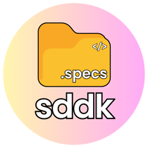
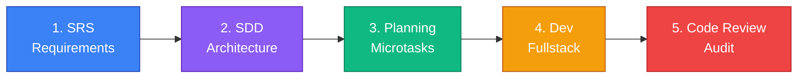

<!-- prettier-ignore -->
<div align="center">



# Spec-Driven Development Kit (SDDK)

*An AI agent plugin that enforces disciplined software engineering through a 5-stage specification-driven pipeline.*

[](https://www.npmjs.com/package/@daniel-da-silva-alves/sddk)
[]()
[]()
[]()
[](LICENSE)

[Overview](#overview) • [The Pipeline](#the-pipeline) • [Installation](#installation) • [Usage](#usage) • [Project Structure](#project-structure) • [Features](#features)

</div>

---

## Overview

**SDDK** is a plugin for AI coding agents (Gemini, Claude, and other IDE-integrated agents) that transforms how AI writes software. Instead of letting the agent jump straight into code, SDDK enforces a **rigorous 5-stage engineering pipeline** — from requirements elicitation through code review — ensuring that every line of code is traceable, well-architected, and production-grade.

The core problem SDDK solves: AI agents tend to produce **"tutorial-quality" code** — functional but poorly structured, undocumented, and difficult to maintain. SDDK forces the agent to behave like a **senior engineering team**, producing formal specifications before writing a single line of code.

> [!IMPORTANT]
> SDDK is **not a code generator**. It's a **process enforcer** — a set of 5 sequential skills that guide an AI agent through the same disciplined workflow a professional engineering team would follow.

## The Pipeline

SDDK guides the AI agent through 5 sequential stages. Each stage must be completed and approved before advancing to the next:



| Stage | Skill | Agent Role | Output |
|:---:|:---|:---|:---|
| 1 | **Software Requirements Specification** | Senior Requirements Engineer | `srs.md` — Formal requirements doc (IEEE 830) |
| 2 | **System Design Document** | Senior Software Architect | `sdd.md` — Architecture, stack, data model, API design |
| 3 | **Implementation Planning** | Senior Tech Lead | `implementation_plan` — Phased microtasks with traceability |
| 4 | **Fullstack Development** | Senior Fullstack Developer | Production code following specs + inline self-review |
| 5 | **Code Review** | Senior Reviewer & Security Auditor | Audit report + refactoring backlog |

## Installation

### Prerequisites

- An AI coding agent that supports plugins/skills (e.g., Gemini in VS Code, Claude, or compatible IDE agents)
- A workspace/project where you want to apply the SDDK pipeline

### Option A: Install via npm (recommended)

```bash
# Install globally
npm install -g @daniel-da-silva-alves/sddk

# Install the plugin for all projects
sddk install --global
```

Or per-project without permanent install:

```bash
npx @daniel-da-silva-alves/sddk install
```

### Option B: Install manually

1. Clone this repository:
   ```bash
   git clone https://github.com/Daniel-da-Silva-Alves/Spec-Driven-Development-Kit.git
   ```

2. Copy the `sddk` folder into your agent's plugin directory:
   ```
   # Example for Gemini in VS Code:
   cp -r sddk/ ~/.gemini/config/plugins/sddk/

   # Or on Windows:
   xcopy /E /I sddk %USERPROFILE%\.gemini\config\plugins\sddk
   ```

3. Restart your IDE. The agent will automatically detect the 5 skills.

> [!TIP]
> You can verify the installation by asking your agent: *"What skills do you have available?"* — it should list the 5 SDDK skills.

## Usage

### Starting the Pipeline

To begin, simply describe the feature you want to build. Use natural language — the agent will activate the first skill (SRS) and guide you through the process:

```
You:  "I want to create an authentication feature with email/password and OAuth"
Agent: "I'll conduct an interview to fully specify this feature. Let's go topic by topic..."
```

### Stage 1 — Requirements Specification (SRS)

The agent acts as a **Senior Requirements Engineer** and conducts a **Socratic interview** — asking one question at a time to eliminate ambiguity:

```
Agent: "What should happen when a user enters an incorrect password 3 times?"
  a) Lock the account for 15 minutes
  b) Lock the account until admin reset
  c) Show CAPTCHA
  d) Other

You:  (select your choice)
```

After all questions are answered, the agent generates a formal **SRS document** following IEEE 830 and saves it to:
```
.specs/features/{feature-name}/srs.md
```

### Stage 2 — System Design Document (SDD)

The agent shifts to **Senior Software Architect** and conducts a technical interview covering:

- Stack selection and validation
- Architecture pattern (MVC, Clean Architecture, Hexagonal, etc.)
- Data model and persistence strategy
- API design (endpoints, request/response formats)
- Frontend componentization and state management
- Documentation sources for each technology

> [!NOTE]
> On first run, the agent will also conduct a **project standards onboarding**, generating reusable standards in `.specs/standards/` (architecture, naming conventions, design system, API conventions, coding standards). These apply to **all features** going forward.

Output: `.specs/features/{feature-name}/sdd.md`

### Stage 3 — Implementation Planning

The agent becomes a **Senior Tech Lead** and decomposes the work into **phased microtasks**, ordered by dependency layer:

1. Configuration and setup
2. Data model / migrations
3. Data access layer (repositories)
4. Business logic (services)
5. API / endpoints
6. UI components
7. Integration between layers
8. Polish and edge cases

Each microtask includes:
- References to specific SRS requirements (`RF-001`, `RF-002`, ...)
- References to specific SDD sections (with file links and line numbers)
- References to project standards
- List of files to create/modify
- Clear "definition of done"

The agent also generates **manual test scenarios** in `.specs/features/{feature-name}/manual-tests.md`.

### Stage 4 — Fullstack Development

The agent executes as a **Senior Fullstack Developer**, implementing one microtask at a time:

- Reads only the referenced SRS/SDD sections for each task (optimized context usage)
- Follows clean code rules — no generic names, no obvious comments, no boilerplate
- Applies **anti-AI-design patterns** — no emojis in UI, no generic CSS, no placeholder text
- Performs **inline self-review** after each microtask before marking it complete
- Consults official documentation following the priority hierarchy defined in the SDD

### Stage 5 — Code Review

The agent performs a comprehensive audit as a **Senior Code Reviewer & Security Auditor**, checking 6 categories:

| Category | What it checks |
|:---|:---|
| Code Quality | Clean code, naming conventions, anti-AI patterns, component granularity |
| Security | Input validation, injection vulnerabilities, CORS, hardcoded secrets |
| SDD Adherence | Architecture layers, data model, API design, design tokens |
| Componentization | Reusable components, design system consistency, responsiveness |
| API Usage | Correct API versions, non-deprecated patterns, proper imports |
| Standards Compliance | All `.specs/standards/` rules enforced |

Issues are classified by severity:
- **Critical** — fixed immediately (security, breaking bugs, SDD violations)
- **Medium/Low** — documented in `.specs/features/{feature-name}/refactoring-backlog.md`

### Generated Project Artifacts

After completing the pipeline, your project will contain:

```
.specs/
├── standards/                        # Project-wide standards (generated once)
│   ├── architecture.md
│   ├── naming-conventions.md
│   ├── design-system.md
│   ├── api-conventions.md
│   └── coding-standards.md
└── features/
    └── {feature-name}/
        ├── srs.md                    # Stage 1 — Requirements specification
        ├── sdd.md                    # Stage 2 — System design document
        ├── manual-tests.md           # Stage 3 — Test scenarios
        └── refactoring-backlog.md    # Stage 5 — Non-critical improvements
```

## Project Structure

```
Spec-Driven-Development-Kit/
├── bin/
│   └── cli.js                                   # CLI installer (zero dependencies)
├── sddk/
│   ├── plugin.json                              # Plugin manifest
│   └── skills/
│       ├── software-requirements-specification/
│       │   ├── SKILL.md                         # Skill 1 — SRS
│       │   └── references/
│       │       ├── ieee-830-template.md
│       │       ├── socratic-interview-guide.md
│       │       └── checklist-template.md
│       ├── system-design-document/
│       │   ├── SKILL.md                         # Skill 2 — SDD
│       │   └── references/
│       │       ├── sdd-template.md
│       │       ├── architecture-patterns.md
│       │       ├── tech-stack-analysis.md
│       │       ├── documentation-sources-guide.md
│       │       ├── standards-onboarding-guide.md
│       │       └── standards-*-template.md      # 5 standards templates
│       ├── implementation-planning/
│       │   ├── SKILL.md                         # Skill 3 — Planning
│       │   └── references/
│       │       ├── microtask-template.md
│       │       └── manual-tests-template.md
│       ├── fullstack-development/
│       │   ├── SKILL.md                         # Skill 4 — Dev
│       │   └── references/
│       │       ├── self-review-checklist.md
│       │       └── clean-code-rules.md
│       └── code-review/
│           ├── SKILL.md                         # Skill 5 — Code Review
│           └── references/
│               ├── anti-ai-design-patterns.md
│               ├── security-checklist.md
│               └── refactoring-severity-guide.md
├── docs/
│   ├── sddk.svg                                 # Project logo
│   └── ARCHITECTURE.md                          # Architecture documentation and diagrams
└── .github/                                     # Issue & PR templates
```

## Features

- **Socratic Requirements Elicitation** — The agent interviews you question-by-question, challenging vague answers and detecting ambiguities before anything is built
- **IEEE 830 / ISO 29148 Compliance** — Requirements documents follow formal standards, not ad-hoc notes
- **Full Traceability** — Every microtask traces back to specific SRS requirements and SDD sections with file links and line numbers
- **Project Standards Onboarding** — On first use, the agent establishes reusable standards (architecture, naming, design system, API, coding) that apply to all future features
- **Anti-AI-Design Detection** — The code review skill actively detects and rejects 8 common patterns of sloppy AI-generated code (emojis in UI, generic CSS, placeholder text, monolithic components, etc.)
- **Security Audit Built-In** — Every feature goes through a security checklist covering injection, CORS, secrets, auth, and input validation
- **Documentation-First Development** — The agent consults official docs (with version pinning) instead of relying on potentially stale training data
- **Optimized Context Usage** — The dev skill reads only the specific SRS/SDD sections referenced by each microtask, not the entire document

> [!WARNING]
> SDDK is designed for **feature-level development**. Each run of the pipeline specifies, designs, plans, implements, and reviews a single feature. For multi-feature projects, run the pipeline once per feature.
