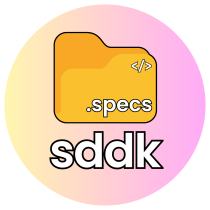
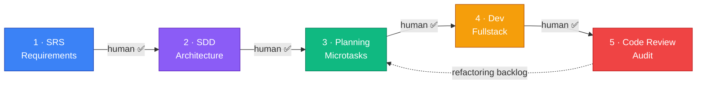
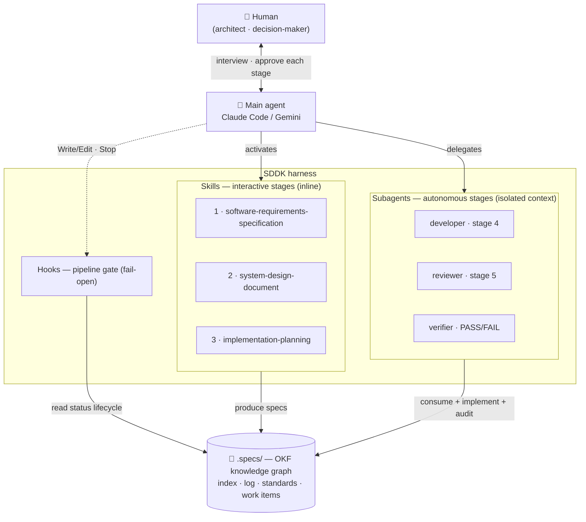
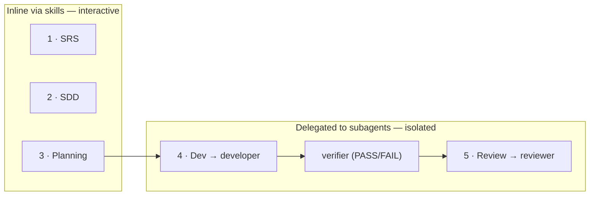
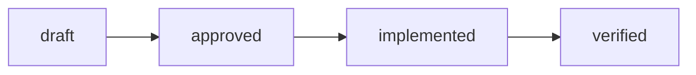

<!-- prettier-ignore -->
<div align="center">



# Spec-Driven Development Kit (SDDK)

*An AI-agent plugin that turns "vibe coding" into disciplined software engineering — a spec-driven pipeline with human decision gates, specialized subagents, and enforced quality checks.*

[](https://www.npmjs.com/package/@daniel-da-silva-alves/sddk)
[]()
[]()
[]()
[](LICENSE)

[Overview](#overview) • [Harness architecture](#harness-architecture) • [Installation](#installation) • [Usage](#usage) • [The .specs knowledge graph](#the-specs-knowledge-graph) • [Repository layout](#repository-layout)

</div>

---

## Overview

**SDDK** is a plugin for AI coding agents (Claude Code and Gemini) that stops the agent from jumping straight to code. Instead, it runs a **five-stage, spec-driven pipeline** — from requirements elicitation to code review — where **the human decides and the AI executes**.

The problem it solves: unconstrained AI agents produce *tutorial-quality* code — functional but poorly structured, undocumented, and hard to maintain. SDDK makes the agent behave like a senior engineering team, writing formal specifications before a single line of code and keeping a human in the loop at every architectural decision.

> [!IMPORTANT]
> SDDK is **not a code generator**. It is a **process harness**: a set of skills, subagents, and enforcement hooks that guide and gate an agent through a disciplined workflow, producing a traceable [`.specs/`](#the-specs-knowledge-graph) knowledge graph as the project's durable memory.


```mermaid
graph LR
    SRS["1 · SRS<br>Requirements"] -->|"human ✅"| SDD["2 · SDD<br>Architecture"]
    SDD -->|"human ✅"| PLAN["3 · Planning<br>Microtasks"]
    PLAN -->|"human ✅"| DEV["4 · Dev<br>Fullstack"]
    DEV -->|"human ✅"| CR["5 · Code Review<br>Audit"]
    CR -.->|"refactoring backlog"| PLAN

    style SRS fill:#3B82F6,stroke:#1E40AF,color:#fff
    style SDD fill:#8B5CF6,stroke:#5B21B6,color:#fff
    style PLAN fill:#10B981,stroke:#047857,color:#fff
    style DEV fill:#F59E0B,stroke:#B45309,color:#fff
    style CR fill:#EF4444,stroke:#B91C1C,color:#fff
```

---

## Harness architecture

SDDK is a small ecosystem of cooperating parts around a single main agent. Behavior lives in **markdown** (skills and subagents), enforcement lives in **zero-dependency Node hooks**, and everything reads and writes one shared **OKF knowledge graph**.


```mermaid
graph TB
    Human["👤 Human<br>(architect · decision-maker)"]
    Agent["🤖 Main agent<br>Claude Code / Gemini"]
    Human <-->|"interview · approve each stage"| Agent

    subgraph Harness["SDDK harness"]
        direction TB
        subgraph Skills["Skills — interactive stages (inline)"]
            S1["1 · software-requirements-specification"]
            S2["2 · system-design-document"]
            S3["3 · implementation-planning"]
        end
        subgraph Subs["Subagents — autonomous stages (isolated context)"]
            D["developer · stage 4"]
            R["reviewer · stage 5"]
            V["verifier · PASS/FAIL"]
        end
        Hooks["Hooks — pipeline gate (fail-open)"]
    end

    Agent -->|"activates"| Skills
    Agent -->|"delegates"| Subs
    Agent -.->|"Write/Edit · Stop"| Hooks

    Skills -->|"produce specs"| Specs
    Subs -->|"consume + implement + audit"| Specs
    Hooks -->|"read status lifecycle"| Specs

    Specs[("📂 .specs/ — OKF knowledge graph<br>index · log · standards · work items")]
```

### Components

| Layer | Lives in | Role |
|:---|:---|:---|
| **Skills** (5) | `sddk/skills/` | The authoritative pipeline behavior. Each stage is a `SKILL.md` + reference templates the agent follows. |
| **Subagents** (3) | `sddk/agents/` | Specialized personas that run in an isolated context: `developer`, `reviewer`, `verifier`. |
| **Hooks** | `sddk/hooks/` | Deterministic, zero-dependency pipeline gate (`sddk-gate.mjs`) wired via `hooks.json`. |
| **Plugin manifests** | `sddk/.claude-plugin/`, `.claude-plugin/` | Native Claude Code plugin + marketplace catalog. |
| **CLI installer** | `bin/cli.js` | Zero-dependency npm installer for Claude Code and Gemini. |
| **Pipeline awareness** | `sddk/CLAUDE.md` | Injected instructions so the agent knows the pipeline and when to delegate. |
| **Knowledge graph** | `.specs/` (per project) | The OKF-formatted output: specs, standards, and project memory. |

### Hybrid execution model

Not every stage should run the same way. The first three stages are **interview-driven** — they need a live back-and-forth with the human. The last two are **autonomous** — heavy, self-contained work that benefits from an isolated context.


```mermaid
graph LR
    subgraph Inline["Inline via skills — interactive"]
        A["1 · SRS"]
        B["2 · SDD"]
        C["3 · Planning"]
    end
    subgraph Delegated["Delegated to subagents — isolated"]
        D["4 · Dev → developer"]
        E["5 · Review → reviewer"]
        F["verifier (PASS/FAIL)"]
    end
    C --> D --> F --> E
```

- **Stages 1–3 (skills):** the agent stays in the conversation, runs the Socratic interview, and the human approves before advancing.
- **Stages 4–5 (subagents):** the agent delegates to `developer` (writes code) and `reviewer` (read-only audit). Each has its stage skill **preloaded**, so the pipeline logic stays in one place.
- **`verifier`:** an independent, read-only auditor that returns `PASS`/`FAIL` on whether the implementation satisfies the spec, SDD, and manual tests — run after Dev, before Code Review sets `status: verified`.

> [!NOTE]
> Subagents run headless-in-context: they take one prompt and return a result — no user dialogue mid-task. That is exactly why interview stages stay as skills and only autonomous stages become subagents. See [ARCHITECTURE.md](ARCHITECTURE.md) for the full rationale.

### Enforcement: the status lifecycle

Every work item's anchor spec carries a `status` that advances through a fixed lifecycle. The Stop hook makes it more than a convention.


```mermaid
graph LR
    draft --> approved --> implemented --> verified
```

| Hook | Trigger | Behavior |
|:---|:---|:---|
| **Stop gate** | End of an agent turn | **Blocks** if a work item is `implemented` but not yet `verified` (code shipped without review). |
| **Pre-write gate** | `Write` / `Edit` | **Advisory only** — nudges when the active spec is still `draft`. Never blocks. |

> [!IMPORTANT]
> Hooks are **fail-open**: any missing file, parse error, or ambiguity results in *allow*. The gate never blocks legitimate work on uncertainty.

---

## Installation

**Prerequisites:** an AI agent that supports plugins/skills (Claude Code or Gemini) and Node.js ≥ 18.

### Claude Code — native plugin (recommended)

Install directly from this repo as a plugin marketplace — no file copying, versioned updates over git:

```
/plugin marketplace add Daniel-da-Silva-Alves/Spec-Driven-Development-Kit
/plugin install sddk@spec-driven-development-kit
```

This registers the 5 skills (namespaced under `/sddk:`), the 3 subagents (`sddk:developer`, `sddk:reviewer`, `sddk:verifier`), and the pipeline-gate hooks automatically.

### npm CLI (Claude Code or Gemini)

```bash
npm install -g @daniel-da-silva-alves/sddk
sddk install            # interactive IDE selection
```

Or without a permanent install:

```bash
npx @daniel-da-silva-alves/sddk install
```

The installer copies the skills into your IDE's global directory and, for Claude Code, the subagents into `~/.claude/agents/`. Bypass the prompt in CI with a flag:

```bash
sddk install --claude   # or --gemini, or --both
```

> [!TIP]
> Verify anytime with `sddk status`, or ask your agent: *"which SDDK skills and subagents do you have?"* — it should list the 5 skills plus `developer`, `reviewer`, and `verifier`.

---

## Usage

Describe the work you want to do. The agent first asks **what type of work** it is, then activates the matching pipeline — templates and interview depth adapt to the type.

| Type | Directory | Stage 1 document | Standard | Interview depth |
|:---|:---|:---|:---|:---|
| **Feature** | `features/` | `srs.md` | IEEE 830 | Full (12–20 questions) |
| **Fix** | `fix/` | `bug-report.md` | IEEE 1044 | Focused (5–8 questions) |
| **Refactoring** | `refact/` | `refact-spec.md` | IEEE 1219 / ISO 14764 | Moderate (6–10 questions) |
| **Chore** | `chore/` | `chore-spec.md` | ISO 14764 | Minimal (4–7 questions) |

The five stages, each gated by a human approval:

1. **Specification** — *Senior Requirements Engineer.* A Socratic interview (one question at a time) that surfaces ambiguities and produces a formal spec.
2. **System Design** — *Senior Software Architect.* Stack, architecture, data model, and API decisions. On first run, it also generates reusable project standards in `.specs/standards/`.
3. **Planning** — *Senior Tech Lead.* Decomposes the work into phased microtasks, each tracing to specific SRS/SDD sections, plus manual test scenarios.
4. **Development** — *Senior Fullstack Developer* (`developer` subagent). Implements each microtask following the SDD and clean-code rules, reading only the referenced spec sections.
5. **Code Review** — *Senior Reviewer & Security Auditor* (`reviewer` subagent) + independent `verifier`. A quality, security, and anti-AI-design audit before the work item is marked `verified`.

> [!WARNING]
> SDDK works at the **work-item level**: each pipeline run specifies, designs, plans, implements, and reviews a single feature/fix/refactor/chore. For multi-item projects, run the pipeline once per item — they accumulate in the same `.specs/` graph.

---

## The `.specs/` knowledge graph

The pipeline's durable output is a single [Open Knowledge Format](https://cloud.google.com/blog/products/data-analytics/how-the-open-knowledge-format-can-improve-data-sharing) (OKF) bundle — one graph that serves as the project's memory. A file's path is its identity; `index.md` and `log.md` are reserved; relationships are ordinary markdown links, enabling **progressive disclosure** (traverse pointers, load only what a task needs).

```
.specs/                              # OKF bundle — one graph, one project memory
├── index.md                        # project index: module map + navigation entry point
├── log.md                          # changelog (Keep a Changelog)
├── standards/                      # project-wide, generated once, reused everywhere
│   ├── architecture.md             #   layer rules, dependency direction, structure
│   ├── naming-conventions.md
│   ├── design-system.md
│   ├── api-conventions.md
│   └── coding-standards.md
└── {features|fix|refact|chore}/
    └── {work-item}/
        ├── {srs|bug-report|refact-spec|chore-spec}.md   # Stage 1 — anchor spec (owns `status`)
        ├── sdd.md                                       # Stage 2 — design (depth by type)
        ├── implementation-plan.md                       # Stage 3 — phased microtasks
        ├── manual-tests.md                              # Stage 3 — test scenarios
        └── refactoring-backlog.md                       # Stage 5 — non-critical improvements
```

Work types map to the ISO/IEC/IEEE 14764 maintenance taxonomy (new development, corrective, perfective, adaptive/preventive), and SDD depth scales with the type: full (10 sections) for features, reduced (6) for refactors, minimal (4) for fixes and chores.

---

## Repository layout

```
Spec-Driven-Development-Kit/
├── bin/
│   └── cli.js                      # Zero-dependency installer (Claude Code + Gemini)
├── sddk/                           # The plugin
│   ├── plugin.json                 # Plugin manifest (skills list)
│   ├── .claude-plugin/plugin.json  # Claude Code plugin descriptor
│   ├── CLAUDE.md                   # Injected pipeline-awareness instructions
│   ├── skills/                     # 5 pipeline skills (SKILL.md + references/)
│   │   ├── software-requirements-specification/
│   │   ├── system-design-document/
│   │   ├── implementation-planning/
│   │   ├── fullstack-development/
│   │   └── code-review/
│   ├── agents/                     # 3 subagents
│   │   ├── developer.md            #   Dev stage (writes code)
│   │   ├── reviewer.md             #   Code Review stage (read-only)
│   │   └── verifier.md             #   Independent PASS/FAIL verification
│   └── hooks/
│       ├── hooks.json              # PreToolUse (Write|Edit) + Stop wiring
│       └── sddk-gate.mjs           # Fail-open pipeline gate
├── .claude-plugin/
│   └── marketplace.json            # Plugin marketplace catalog
├── .specs/                         # This repo's own OKF graph (dogfooding)
│   ├── index.md · log.md
│   └── standards/                  # architecture · coding · naming
├── doc/                            # ADRs, OKF design, background material
├── tests/
│   └── validate-plugin.mjs         # Plugin consistency tests (node --test)
├── .github/workflows/              # CI (Node 18/20/22) + npm publish on tag
├── ARCHITECTURE.md                 # Deep-dive: design principles & rationale
├── sddk.svg                        # Logo
├── CHANGELOG.md · CONTRIBUTING.md · SECURITY.md · LICENSE
└── package.json
```

---

## Key ideas

- **Specifications before code** — the agent never writes code before a formal, human-approved spec exists.
- **Human authority over technical decisions** — stack, architecture, data model, security, and business rules go through a human gate; the AI proposes trade-offs, the human chooses.
- **Full traceability** — every microtask (and the code it produces) points back to specific SRS requirements and SDD sections; a production bug traces to code → microtask → SDD → SRS → interview answer.
- **Enforced lifecycle** — the Stop hook prevents shipping `implemented` code that has not been `verified`.
- **Anti-AI-design detection** — the Code Review stage rejects 8 hallmarks of sloppy AI output (UI emojis, generic CSS, placeholder text, monolithic components, generic names, obvious comments, boilerplate).
- **Documentation-first** — the agent consults official, version-pinned docs instead of relying on stale training data.
- **Optimized context** — the dev stage reads only the referenced spec sections per microtask, not the whole bundle.

---

## Resources

- [ARCHITECTURE.md](ARCHITECTURE.md) — design principles, single-agent-plus-subagents rationale, and per-stage flows.
- [doc/adr/0001-sddk-memoria-okf-plugin-com-enforcement.md](doc/adr/0001-sddk-memoria-okf-plugin-com-enforcement.md) — the founding architecture decision record.
- [doc/design/okf-perfil-sddk.md](doc/design/okf-perfil-sddk.md) — the OKF `type` vocabulary and frontmatter contract.
- [Open Knowledge Format](https://cloud.google.com/blog/products/data-analytics/how-the-open-knowledge-format-can-improve-data-sharing) — the graph format `.specs/` is built on.
</content>
