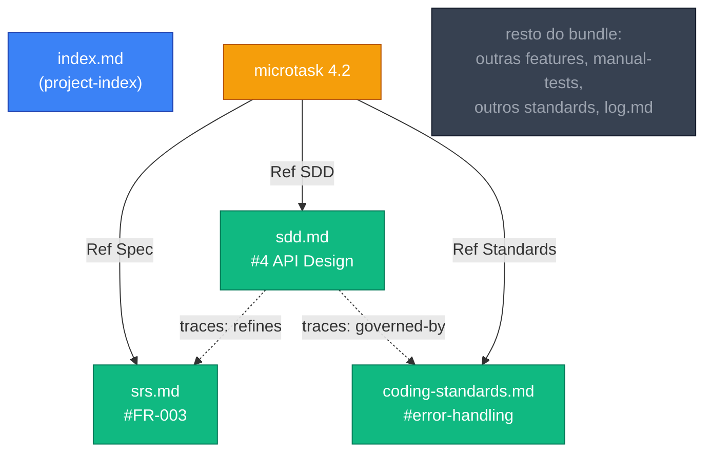

# PoC — Progressive Disclosure sobre o grafo OKF

> **Status:** Rascunho · **Relacionado:** [ADR-0001](../adr/0001-sddk-memoria-okf-plugin-com-enforcement.md) (Action Item 3) · [Perfil OKF](okf-perfil-sddk.md)
>
> Objetivo: demonstrar **como** a skill de Dev navega o `.specs/` como grafo (carregando só os nós necessários) e **estimar** a economia de tokens vs. carregar os documentos inteiros. Os números aqui são **estimativas ilustrativas** para explicar o mecanismo — a medição empírica real é o Action Item 7 do ADR (features piloto).

---

## 1. O cenário

Work item `ass-13-consulta-promocoes` (feature). O agente vai executar **uma** microtask:

```markdown
- [ ] **4.2: Implementar serviço de filtro de promoções por loja**
  - 📎 Ref SDD: [SDD#4 API Design](.specs/features/ass-13-consulta-promocoes/sdd.md#L120-L156)
  - 📎 Ref Spec: [SRS FR-003](.specs/features/ass-13-consulta-promocoes/srs.md#L88-L104)
  - 📎 Ref Standards: [Coding — error handling](.specs/standards/coding-standards.md#error-handling)
  - 📁 Files: `src/services/promotionService.ts` — create
  - ✅ Done: retorna promoções ativas filtradas por `storeId`
```

O bundle inteiro do projeto, nesse ponto, tem muito mais que isso: `index.md`, `log.md`, 5 standards, e N features — cada uma com `srs.md`, `sdd.md`, `implementation-plan.md`, `manual-tests.md`.

## 2. O grafo e o caminho percorrido



**Verde** = carregado (só as seções apontadas). **Cinza** = existe no bundle, mas **nunca entra no contexto** desta microtask. A microtask resolve 3 arestas → 3 fragmentos de seção. As `traces` do frontmatter do `sdd.md` confirmam que ele *refina* o `srs.md` e é *governado por* o standard — o agente não precisa adivinhar dependências.

## 3. Estimativa de tokens (ilustrativa)

Ordens de grandeza típicas para uma feature de média complexidade:

| Abordagem | O que entra no contexto | Estimativa |
|:---|:---|---:|
| **Naïve (dump)** | `srs.md` (~450 lin) + `sdd.md` (~520 lin) + 5 standards (~900 lin) inteiros | **~24k tokens** |
| **Progressive disclosure** | SDD §4 (~36 lin) + SRS FR-003 (~16 lin) + standard §error-handling (~20 lin) | **~1.2k tokens** |

> Estimativa a ~13 tokens/linha de markdown técnico. **Não é medição** — é ilustração da ordem de grandeza (~20× nesta microtask).

O ponto que importa para a tese do ADR: o custo de leitura por microtask fica **~constante** (o working set é sempre 2-3 seções), **independente do tamanho total do bundle**. Adicionar a 10ª feature ao projeto não encarece a execução da microtask 4.2 — porque o resto do grafo permanece cinza. É isto que torna `C_ler` sublinear.

## 4. O que mantém a economia real (não só teórica)

1. **As arestas precisam existir e apontar certo.** Se a microtask não tiver os `📎` pointers com âncoras (`#L120-L156`, `#FR-003`), o agente cai no dump. Por isso a skill de Planning é obrigada a gerar pointers específicos, e a skill de Requirements a ancorar cada `FR-xxx` (feito na migração do `ieee-830-template`).
2. **O agente precisa obedecer.** A *Memory Strategy* da skill de Dev agora instrui explicitamente: entrar pelo `index.md` só para descoberta, seguir arestas, ler `traces` antes de corpos, manter working set de 2-3 seções. Um hook de `PostToolUse` (fase futura) pode alertar se uma leitura trouxer o documento inteiro.
3. **`fix`/`chore` são exceção deliberada** — documentos pequenos, dump é aceitável; a navegação de grafo é para `features`/`refact`.

## 5. Status do PoC

- ✅ Mecanismo escrito na skill de Dev (`fullstack-development/SKILL.md` → *Memory Strategy: Progressive Disclosure over the OKF Graph*).
- ✅ Pré-condições no lugar: pointers na skill de Planning; âncoras `FR-xxx` no template de SRS; `traces` no frontmatter dos templates de SDD/plan.
- ⏳ **Medição empírica** (Action Item 7): rodar 2-3 features piloto e comparar tokens reais dump vs. navegação. Só isso valida os números da §3 — até lá, tratar como estimativa.
