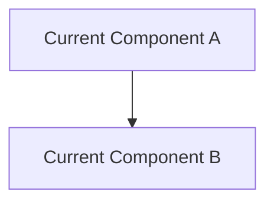
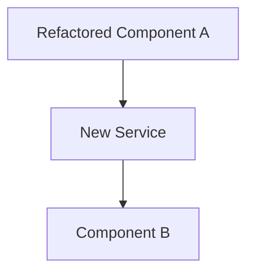

# SDD Template for Refactoring — Reduced (RFC + ADR Style)

Use this template when the work type is `refact/`. This is a reduced version of the full SDD, focused on the architectural delta (current vs proposed), impacted files, and test strategy for behavioral preservation.

---

## Document Structure

```markdown
# System Design Document (SDD)
## {Refactoring Name}

**Version**: 1.0
**Date**: {creation date}
**Project**: {project name}
**Refactoring**: {refactoring name}
**Spec Reference**: [refact-spec.md](./refact-spec.md)

---

## 1. Technical Overview

### 1.1 Summary
What will change architecturally and why. Brief description of the refactoring approach.

### 1.2 Impacted Stack Components

| Component | Version | What Changes |
|:---|:---|:---|
| {technology} | {version} | {description of change} |

### 1.3 Architectural Decisions

| Decision | Choice | Alternatives Considered | Justification |
|:---|:---|:---|:---|
| {e.g.: Pattern change} | {e.g.: Extract Service} | {e.g.: Keep monolithic, use mixin} | {reason} |

---

## 2. Current vs Proposed Architecture

### 2.1 Current Structure

Description and/or diagram of the current implementation.



### 2.2 Proposed Structure

Description and/or diagram of the proposed implementation.



### 2.3 Migration Path

Step-by-step approach to safely transform current → proposed:
1. {step 1 — e.g.: Create new abstraction}
2. {step 2 — e.g.: Migrate consumers one by one}
3. {step 3 — e.g.: Remove old implementation}

---

## 3. Impacted Files

| File | Action | Description |
|:---|:---|:---|
| {path} | Modify | {what changes} |
| {path} | Create | {new file purpose} |
| {path} | Delete | {why removed} |

---

## 4. Test Strategy

### 4.1 Behavioral Preservation Tests
How to verify that external behavior is unchanged after refactoring.

| Invariant | Test Method | Pass Criterion |
|:---|:---|:---|
| {INV-001 from refact-spec} | {unit test / integration test / manual} | {what defines "pass"} |

### 4.2 Quality Metric Validation
How to measure improvement in the targeted quality metrics.

| Metric | Before | After | Measurement Tool |
|:---|:---|:---|:---|
| {metric} | {baseline} | {target} | {tool} |

---

## 5. Spec References

| SDD Section | Refact-Spec Section | Reference |
|:---|:---|:---|
| 2. Architecture | INV-001 | [refact-spec#3](./refact-spec.md#inv-001) |

---

## 6. Technical Documentation Sources

| Technology | Version | Primary Source | Official URL |
|:---|:---|:---|:---|
| {technology} | {version} | {source type} | {URL} |

### Lookup Rule

Priority order for documentation lookup during development:
1. Local project documentation
2. MCP/Skill (if configured)
3. Official URL (use `read_url_content`)
4. Web search (use `search_web`)
```

## Filling Rules

1. **Current vs Proposed MUST include diagrams** when the structural change is non-trivial
2. **Migration path MUST be step-by-step** — not a single "refactor everything" step
3. **Every invariant from refact-spec MUST appear in the test strategy** — no invariant left untested
4. **Quality metrics MUST have baseline measurements** before refactoring starts
5. **Impacted files MUST list ALL files** including tests that need updating
6. **Documentation sources ONLY include technologies relevant to this refactoring** — not the entire stack
