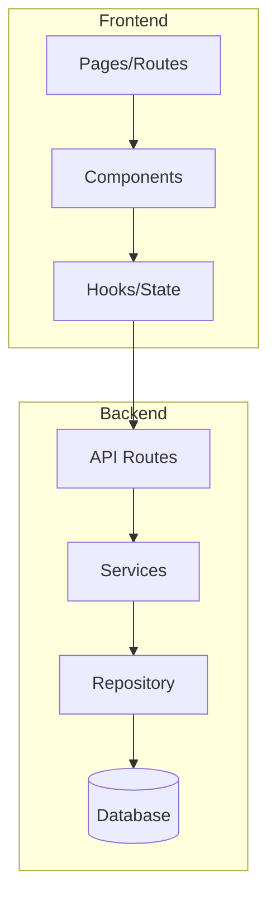
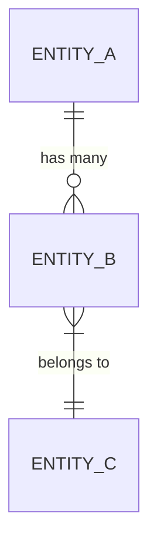

# Template de System Design Document (SDD)

Use este template como base para gerar o documento SDD. Adapte as seções conforme a complexidade da feature.

---

## Estrutura do Documento

```markdown
# System Design Document (SDD)
## {Nome da Feature}

**Versão**: 1.0
**Data**: {data de criação}
**Projeto**: {nome do projeto}
**Feature**: {nome da feature}
**SRS Referência**: [srs.md](./srs.md)

---

## 1. Visão Geral Técnica

### 1.1 Resumo
Breve descrição técnica do que será implementado e como.

### 1.2 Stack Tecnológica

| Camada | Tecnologia | Justificativa |
|:---|:---|:---|
| Linguagem | {ex: TypeScript} | {por que esta escolha} |
| Framework | {ex: Next.js 14} | {por que esta escolha} |
| Banco de dados | {ex: PostgreSQL} | {por que esta escolha} |
| ORM/Query | {ex: Prisma} | {por que esta escolha} |
| Autenticação | {ex: NextAuth.js} | {por que esta escolha} |
| Estilização | {ex: Tailwind CSS v4} | {por que esta escolha} |

### 1.3 Decisões Arquiteturais

| Decisão | Escolha | Alternativas Consideradas | Justificativa |
|:---|:---|:---|:---|
| Padrão | {ex: Clean Architecture} | MVC, Hexagonal | {razão} |
| State Management | {ex: Zustand} | Redux, Context | {razão} |

---

## 2. Arquitetura do Sistema

### 2.1 Diagrama de Arquitetura



### 2.2 Estrutura de Diretórios

```
src/
├── app/                    # Routes / pages
├── components/             # Componentes reutilizáveis
│   ├── ui/                 # Design system (atoms)
│   └── features/           # Componentes de feature
├── lib/                    # Utilitários e helpers
├── services/               # Lógica de negócio
├── repositories/           # Acesso a dados
├── types/                  # TypeScript types/interfaces
└── config/                 # Configurações
```

### 2.3 Camadas e Responsabilidades

| Camada | Responsabilidade | Exemplo |
|:---|:---|:---|
| **Presentation** | UI, formulários, validação visual | Componentes React |
| **Application** | Orquestração, use cases | Services |
| **Domain** | Regras de negócio puras | Entidades, Value Objects |
| **Infrastructure** | Acesso a dados, APIs externas | Repositories, API clients |

---

## 3. Modelo de Dados

### 3.1 Entidades

#### {NomeEntidade}

| Campo | Tipo | Constraints | Descrição |
|:---|:---|:---|:---|
| id | UUID | PK, auto-generated | Identificador único |
| {campo} | {tipo} | {constraints} | {descrição} |
| created_at | DateTime | NOT NULL, default NOW | Data de criação |
| updated_at | DateTime | NOT NULL, auto-update | Última atualização |

### 3.2 Relacionamentos



### 3.3 Migrations

Lista de migrations necessárias em ordem:
1. `001_create_{table}.sql` — Criar tabela principal
2. `002_create_{table}.sql` — Criar tabelas secundárias

---

## 4. Design de API

### 4.1 Endpoints

#### `POST /api/{resource}`
- **Descrição**: {o que faz}
- **Auth**: {requer autenticação? qual role?}
- **Request Body**:
  ```json
  {
    "field": "type — descrição"
  }
  ```
- **Response 200**:
  ```json
  {
    "data": {}
  }
  ```
- **Errors**: 400 (validação), 401 (não autenticado), 403 (não autorizado), 500 (erro interno)

### 4.2 Validações

| Endpoint | Campo | Regra |
|:---|:---|:---|
| POST /api/{resource} | {campo} | {regra de validação} |

---

## 5. Design de Interface (Frontend)

### 5.1 Componentes

| Componente | Tipo | Descrição |
|:---|:---|:---|
| `{ComponentName}` | Page | {descrição} |
| `{ComponentName}` | Feature | {descrição} |
| `{ComponentName}` | UI/Atom | {descrição} |

### 5.2 Estado e Fluxo de Dados

Descrever como o estado flui entre componentes:
- Fonte de dados
- Estado local vs global
- Cache strategy

### 5.3 Design Tokens

| Token | Valor | Uso |
|:---|:---|:---|
| `--color-primary` | {valor} | {onde usar} |
| `--spacing-md` | {valor} | {onde usar} |

---

## 6. Integrações

### 6.1 APIs Externas

| Serviço | Propósito | Endpoint | Auth |
|:---|:---|:---|:---|
| {nome} | {para quê} | {URL base} | {tipo de auth} |

### 6.2 Eventos / Webhooks

| Evento | Trigger | Payload |
|:---|:---|:---|
| {nome} | {quando dispara} | {dados enviados} |

---

## 7. Tratamento de Erros

### 7.1 Estratégia

| Camada | Estratégia | Exemplo |
|:---|:---|:---|
| Frontend | {ex: Error Boundary + toast} | {quando usar} |
| API | {ex: HTTP status + error body padronizado} | {formato} |
| Service | {ex: Custom exceptions + logging} | {tipos de erro} |

### 7.2 Error Codes

| Código | Mensagem | Ação do Usuário |
|:---|:---|:---|
| {code} | {mensagem} | {o que fazer} |

---

## 8. Segurança

### 8.1 Autenticação
Descrever mecanismo de autenticação.

### 8.2 Autorização
Descrever modelo de permissões (RBAC, ABAC, etc.).

### 8.3 Proteção de Dados
Campos sensíveis, criptografia, LGPD/GDPR.

---

## 9. Referências ao SRS

| Seção SDD | Requisito SRS | Referência |
|:---|:---|:---|
| 3. Modelo de Dados | RF-001 | [SRS#3 RF-001](./srs.md#rf-001) |

---

## 10. Fontes de Documentação Técnica

### 10.1 Configuração de Fontes

| Tecnologia | Versão | Fonte Primária | URL Oficial | MCP/Skill |
|:---|:---|:---|:---|:---|
| {tecnologia} | {versão} | {URL oficial / MCP / Skill / Docs local} | {URL} | {nome do MCP ou —} |

### 10.2 Documentação Local do Projeto

| Caminho | Conteúdo |
|:---|:---|
| {caminho} | {descrição do conteúdo} |

### 10.3 Regra de Consulta

Ordem de prioridade para consulta de documentação durante o desenvolvimento:
1. Documentação local do projeto (caminhos listados em 10.2)
2. MCP/Skill (se listado na coluna MCP/Skill em 10.1)
3. URL oficial (usar `read_url_content` na URL listada em 10.1)
4. Web search (usar `search_web` com query: "{tecnologia} {versão} {tópico} site:{domínio oficial}")
```

## Regras de Preenchimento

1. **Cada decisão arquitetural DEVE ter justificativa** — nunca apenas "porque sim"
2. **Modelo de dados DEVE corresponder aos requisitos do SRS** — usar matriz de referência
3. **Endpoints DEVEM cobrir todos os requisitos funcionais** do SRS
4. **Componentes DEVEM ser granulares** — nunca um componente monolítico
5. **Design tokens DEVEM ser definidos** — nunca usar valores hardcoded
6. **Fontes de documentação DEVEM ser configuradas** para cada tecnologia da stack com versão pinada
