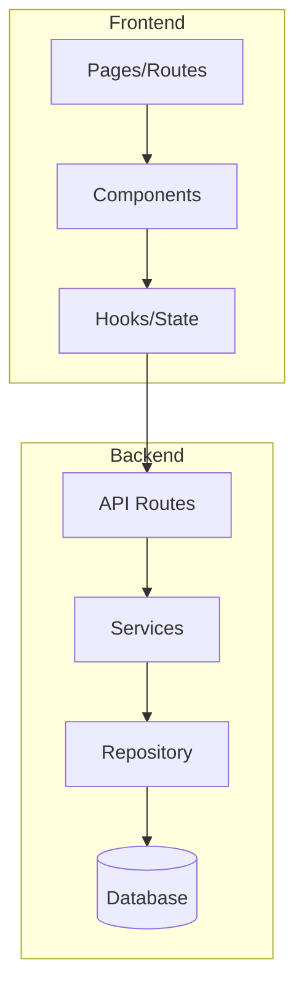
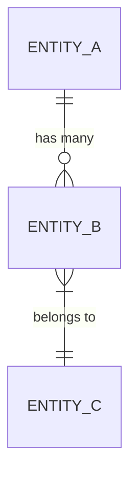

# System Design Document (SDD) Template

Use this template as a base to generate the SDD document. Adapt sections according to the feature's complexity.

---

## Document Structure

```markdown
# System Design Document (SDD)
## {Feature Name}

**Version**: 1.0
**Date**: {creation date}
**Project**: {project name}
**Feature**: {feature name}
**SRS Reference**: [srs.md](./srs.md)

---

## 1. Technical Overview

### 1.1 Summary
Brief technical description of what will be implemented and how.

### 1.2 Technology Stack

| Layer | Technology | Justification |
|:---|:---|:---|
| Language | {e.g.: TypeScript} | {why this choice} |
| Framework | {e.g.: Next.js 14} | {why this choice} |
| Database | {e.g.: PostgreSQL} | {why this choice} |
| ORM/Query | {e.g.: Prisma} | {why this choice} |
| Authentication | {e.g.: NextAuth.js} | {why this choice} |
| Styling | {e.g.: Tailwind CSS v4} | {why this choice} |

### 1.3 Architectural Decisions

| Decision | Choice | Alternatives Considered | Justification |
|:---|:---|:---|:---|
| Pattern | {e.g.: Clean Architecture} | MVC, Hexagonal | {reason} |
| State Management | {e.g.: Zustand} | Redux, Context | {reason} |

---

## 2. System Architecture

### 2.1 Architecture Diagram



### 2.2 Directory Structure

```
src/
├── app/                    # Routes / pages
├── components/             # Reusable components
│   ├── ui/                 # Design system (atoms)
│   └── features/           # Feature components
├── lib/                    # Utilities and helpers
├── services/               # Business logic
├── repositories/           # Data access
├── types/                  # TypeScript types/interfaces
└── config/                 # Configurations
```

### 2.3 Layers and Responsibilities

| Layer | Responsibility | Example |
|:---|:---|:---|
| **Presentation** | UI, forms, visual validation | React Components |
| **Application** | Orchestration, use cases | Services |
| **Domain** | Pure business rules | Entities, Value Objects |
| **Infrastructure** | Data access, external APIs | Repositories, API clients |

---

## 3. Data Model

### 3.1 Entities

#### {EntityName}

| Field | Type | Constraints | Description |
|:---|:---|:---|:---|
| id | UUID | PK, auto-generated | Unique identifier |
| {field} | {type} | {constraints} | {description} |
| created_at | DateTime | NOT NULL, default NOW | Creation date |
| updated_at | DateTime | NOT NULL, auto-update | Last update |

### 3.2 Relationships



### 3.3 Migrations

List of required migrations in order:
1. `001_create_{table}.sql` — Create main table
2. `002_create_{table}.sql` — Create secondary tables

---

## 4. API Design

### 4.1 Endpoints

#### `POST /api/{resource}`
- **Description**: {what it does}
- **Auth**: {requires authentication? which role?}
- **Request Body**:
  ```json
  {
    "field": "type — description"
  }
  ```
- **Response 200**:
  ```json
  {
    "data": {}
  }
  ```
- **Errors**: 400 (validation), 401 (unauthenticated), 403 (unauthorized), 500 (internal error)

### 4.2 Validations

| Endpoint | Field | Rule |
|:---|:---|:---|
| POST /api/{resource} | {field} | {validation rule} |

---

## 5. Interface Design (Frontend)

### 5.1 Components

| Component | Type | Description |
|:---|:---|:---|
| `{ComponentName}` | Page | {description} |
| `{ComponentName}` | Feature | {description} |
| `{ComponentName}` | UI/Atom | {description} |

### 5.2 State and Data Flow

Describe how state flows between components:
- Data source
- Local vs global state
- Cache strategy

### 5.3 Design Tokens

| Token | Value | Usage |
|:---|:---|:---|
| `--color-primary` | {value} | {where to use} |
| `--spacing-md` | {value} | {where to use} |

---

## 6. Integrations

### 6.1 External APIs

| Service | Purpose | Endpoint | Auth |
|:---|:---|:---|:---|
| {name} | {what for} | {base URL} | {auth type} |

### 6.2 Events / Webhooks

| Event | Trigger | Payload |
|:---|:---|:---|
| {name} | {when it fires} | {data sent} |

---

## 7. Error Handling

### 7.1 Strategy

| Layer | Strategy | Example |
|:---|:---|:---|
| Frontend | {e.g.: Error Boundary + toast} | {when to use} |
| API | {e.g.: HTTP status + standardized error body} | {format} |
| Service | {e.g.: Custom exceptions + logging} | {error types} |

### 7.2 Error Codes

| Code | Message | User Action |
|:---|:---|:---|
| {code} | {message} | {what to do} |

---

## 8. Security

### 8.1 Authentication
Describe the authentication mechanism.

### 8.2 Authorization
Describe the permissions model (RBAC, ABAC, etc.).

### 8.3 Data Protection
Sensitive fields, encryption, LGPD/GDPR.

---

## 9. SRS References

| SDD Section | SRS Requirement | Reference |
|:---|:---|:---|
| 3. Data Model | FR-001 | [SRS#3 FR-001](./srs.md#fr-001) |

---

## 10. Technical Documentation Sources

### 10.1 Source Configuration

| Technology | Version | Primary Source | Official URL | MCP/Skill |
|:---|:---|:---|:---|:---|
| {technology} | {version} | {Official URL / MCP / Skill / Local docs} | {URL} | {MCP name or —} |

### 10.2 Local Project Documentation

| Path | Content |
|:---|:---|
| {path} | {content description} |

### 10.3 Lookup Rule

Priority order for documentation lookup during development:
1. Local project documentation (paths listed in 10.2)
2. MCP/Skill (if listed in the MCP/Skill column in 10.1)
3. Official URL (use `read_url_content` on the URL listed in 10.1)
4. Web search (use `search_web` with query: "{technology} {version} {topic} site:{official domain}")
```

## Filling Rules

1. **Each architectural decision MUST have justification** — never just "because"
2. **Data model MUST correspond to SRS requirements** — use reference matrix
3. **Endpoints MUST cover all functional requirements** from the SRS
4. **Components MUST be granular** — never a monolithic component
5. **Design tokens MUST be defined** — never use hardcoded values
6. **Documentation sources MUST be configured** for each technology in the stack with pinned version
